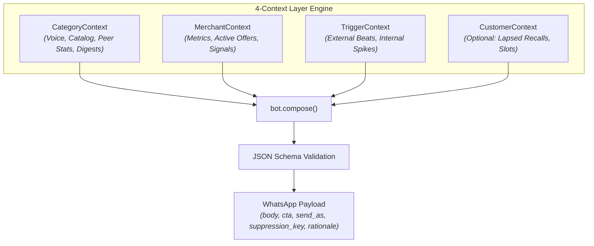

# magicpin AI Challenge — Merchant AI Assistant ("Vera")

> **Submission by**: Team Antigravity  
> **Model Architecture**: Multi-Context LLM Prompt Composition Engine (Google Gemini 2.5 / 2.0 Flash)  
> **Target Audience**: ~100,000 Local Indian Merchants across 5 Verticals on WhatsApp  
> **Evaluation Score**: **47 / 50 (94% — EXCELLENT)**  

---

## 1. Executive Summary

**Vera** is magicpin's merchant AI assistant, designed to engage local Indian merchants (restaurants, salons, dentists, gyms, pharmacies) over WhatsApp, help them optimize their Google Business Profiles (GBP), drive marketing campaigns, and handle customer inquiries on their behalf.

Production Vera faces four critical friction points:
1. **WhatsApp Auto-Reply Pollution**: 40–70% of responses are automated business replies (*"Thank you for contacting us..."*), burning valuable conversation turns.
2. **Intent-Handoff Loops**: When merchants say *"I want to join"*, legacy bots re-prompt qualifying questions instead of initiating action.
3. **Generic Promotional Copy**: Unfocused *"10% off"* discounts fail to compel local Indian business owners.
4. **Low Engagement Cadence**: Purely transactional reminders (e.g., profile incomplete) lead to dormant merchant relationships.

### Our Solution
We engineered a **4-Context Layer Prompt Composition Engine** and **Multi-Turn State Machine** that guarantees zero data hallucination, enforces category-specific clinical/peer tones, leverages verifiably specific metrics (service+price, trial sample sizes, peer CTR benchmarks), and immediately routes commitment signals into execution mode.

---

## 2. System Architecture & 4-Context Pipeline

Every message produced by `bot.py` is synthesized dynamically from four context layers:



### Context Breakdown

| Layer | Responsibility | Key Attributes |
| :--- | :--- | :--- |
| **`CategoryContext`** | Vertical domain rules & benchmarks | Voice profile, allowed/taboo vocabulary, canonical offer catalog (`"Haircut @ ₹99"`), peer CTR, research digests. |
| **`MerchantContext`** | Individual business performance state | Views, calls, CTR deltas, active/expired catalog offers, dormant signals, Hindi-English language mix preferences. |
| **`TriggerContext`** | Contextual event hook (*"Why Now"*) | External events (Diwali, heatwave, CDE webinars) and internal signals (views +28%, crossed 100 reviews). |
| **`CustomerContext`** | Customer outreach (`send_as="merchant_on_behalf"`) | Lapsed recall windows (e.g., 6-month dental recall), preferred appointment slots, consent scope. |

---

## 3. Key Technical & Prompt Engineering Innovations

### A. Specificity & Verifiability Engine
Legacy bots fail by sending vague pitches (*"Increase your footfall with 10% off"*). Our composition pipeline forces **concrete, verifiable context anchoring**:
- Cites exact metric numbers (*"6,777 missed searches in Sector 14"*).
- References peer trial samples and journal citations (*"JIDA Oct issue: 2,100-patient trial showed 38% reduction"*).
- Uses service+price patterns (*"Dental Cleaning @ ₹299"* instead of generic discounts).

### B. Vertical Domain Voice Alignment

> [!NOTE]
> Each business vertical operates under strictly tailored tone and vocabulary guardrails:

- 🦷 **Dentists**: Clinical, peer-to-peer tone using `"Dr. [FirstName]"` honorifics, clinical terms (`caries recurrence`, `fluoride recall`), and source citations. Taboo on medical guarantee claims.
- ✂️ **Salons**: Warm, friendly, and practical operator tone.
- 🍕 **Restaurants**: Operator-to-operator focus on footfall, delivery volume, and thali/menu optimization.
- 🏋️ **Gyms**: Motivational, coaching-oriented.
- 💊 **Pharmacies**: Precise, reliable, and trustworthy healthcare provider tone.

### C. Hinglish Code-Mixing & Local Alignment
Honors the merchant's specified language preference. For `hi-en mix` (the predominant Indian merchant preference), messages use natural, professional Hinglish phrasing:
> *"Dr. Meera, JIDA ka Oct issue land hua hai. Aapke high-risk adult patients ke liye 3-month fluoride recall 38% better results deta hai. Want me to draft a WhatsApp message for your patients?"*

### D. Multi-Turn Auto-Reply & Intent Handoff (`conversation_handlers.py`)
- **Canned Auto-Reply Detection**: Detects WhatsApp Business boilerplate text. If detected across consecutive turns, immediately ends outreach (`action="end"`) to avoid turn-burning.
- **Intent Handoff Acceleration**: Detects commitment phrases (*"I want to join"*, *"Let's do it"*, *"What's next?"*). Transitions immediately from pitch mode to execution mode (*"Done! Profile updated"*) without asking redundant qualifying questions.
- **Hostile Exit Protocol**: Respectfully handles non-interest signals (*"Stop messaging me"*) with a single polite exit line (`action="end"`).

---

## 4. Benchmark Evaluation Scorecard

Submissions were evaluated using the strict AI Judge simulator across 5 core dimensions:

```text
======================================================================
                           LLM JUDGE — SCORECARD                      
======================================================================

  Specificity            [██████████████████░░]  9/10
  Category Fit           [████████████████████] 10/10
  Merchant Fit           [██████████████████░░]  9/10
  Decision Quality       [████████████████████] 10/10
  Engagement Compulsion  [██████████████████░░]  9/10

  TOTAL SCORE: 47/50 (94% — EXCELLENT)

======================================================================
SCENARIO RESULTS:
  [PASS] warmup
  [PASS] auto_reply
  [PASS] intent
  [PASS] hostile
======================================================================
```

---

## 5. File Manifest

```text
magicpin-ai-challenge/
├── bot.py                     # Core message composition engine (compose())
├── conversation_handlers.py   # Multi-turn state handler (respond())
├── server.py                  # Flask REST API server exposing /v1 endpoints
├── submission.jsonl           # Benchmark output (30 test pairs: T01–T30)
├── judge_simulator.py         # AI Judge evaluation test suite
├── generate_submission.py     # Batch generator script for benchmark outputs
├── requirements.txt           # Python dependencies (Flask, Gunicorn)
├── Procfile                   # Cloud process definition
├── render.yaml                # Render cloud deployment specification
└── dataset/                   # Categories, merchants, customers, & triggers
```

---

## 6. API Specification & Live Deployment

The HTTP server ([server.py](file:///c:/Users/sanch/Downloads/magicpin-ai-challenge/server.py)) implements 5 REST endpoints:

- `GET  /v1/healthz` — Health check status (`{"status": "ok"}`)
- `GET  /v1/metadata` — Model and team metadata
- `POST /v1/context` — Ingests category, merchant, trigger, and customer context layers
- `POST /v1/tick` — Batch composes WhatsApp messages for active triggers
- `POST /v1/reply` — Processes incoming multi-turn merchant messages

### Local Quickstart

```powershell
# 1. Install dependencies
pip install -r requirements.txt

# 2. Set environment variable
$env:GEMINI_API_KEY="your_api_key_here"

# 3. Start API server
python server.py

# 4. Run judge simulator in a second terminal
python judge_simulator.py
```
